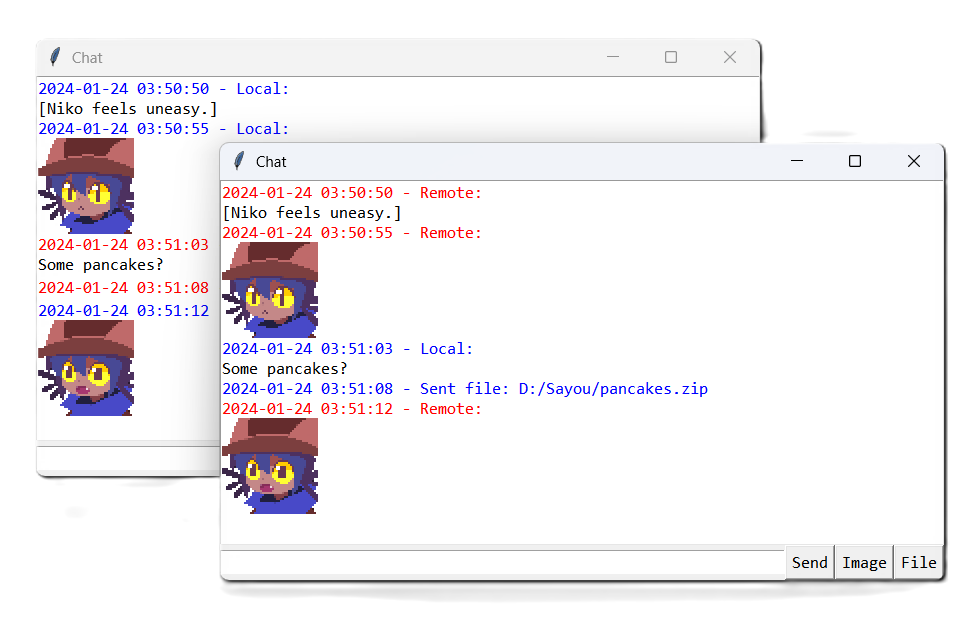

# IMFTP



A file transfer and instant messager program based on TCP/IP, supporting encryption with DHKE and AES-CTR.

## Requirements

- Python 3.6+
- PyCryptodome
- tkinter
- Pillow

## Usage

```
usage: imftp.py [-h] [--server [IP] | --client IP] [--port PORT]
                (--send [FILENAME] | --recv [FILENAME] | --chat) [--size SIZE] [--enc]

Chat and transfer files over TCP/IP

options:
  -h, --help         show this help message and exit
  --server [IP]      run as a server (default)
  --client IP        run as a client (server IP required)
  --port PORT        port number of the server (4096 by default)
  --send [FILENAME]  send file
  --recv [FILENAME]  receive file
  --chat             start a chat session
  --size SIZE        set size limit (unlimited by default, ignored in the chat mode)
  --enc              encrypt the connection with DHKE and AES-CTR (cannot be set on one side only)
```

## Example

### File Transfer

```shell
# Server
$ python3 imftp.py --server --send server_test.txt --size 1024 --enc

# Client
$ python3 imftp.py --client $SERVER_IP --recv client_test.txt --enc
```

Send the first 1024 bytes of `server_test.txt` from the server to the client and save it as `client_test.txt`, encrypting the connection with DHKE and AES-CTR.

### Instant Messager

```shell
# Server
$ python3 imftp.py --server --chat --enc

# Client
$ python3 imftp.py --client $SERVER_IP --chat --enc
```

Start an instant messager between the server and the client, encrypting the connection with DHKE and AES-CTR.
